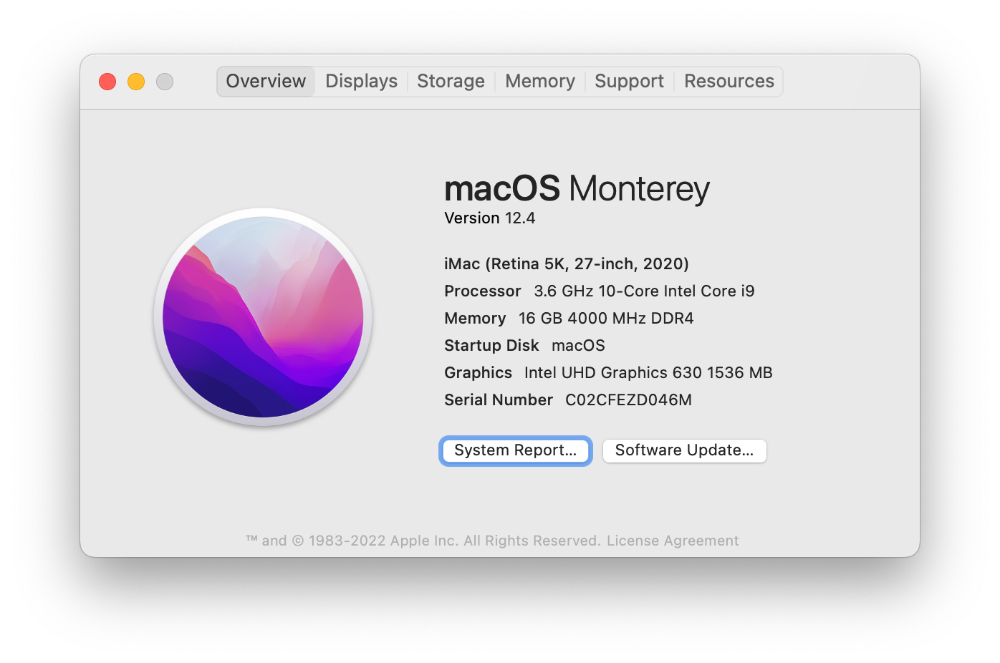

# Hackintosh-Intel-i9-10850k-MSI-Z490-GAMING-EDGE

---

This repository contains OpenCore configuration files for installing macOS Big Sur on an Intel 10th gen CPU and Z490 chipset build



Updated to ~~Big Sur 11.6~~ Monterey 12.4

## Bootloader

[OpenCore](https://dortania.github.io/OpenCore-Install-Guide/) ~~0.7.2~~ 0.8.0

## Hardware

- CPU: Intel i9-10850k
- iGPU: Intel UHD 630
- dGPU: Nvidia RTX3070 (disabled)
- Motherboard: [MSI Z490 GAMING EDGE WIFI](https://www.msi.com/Motherboard/MPG-Z490-GAMING-EDGE-WIFI/Specification)
    - Audio: Realtek ALC1200-VD1
    - Ethernet: 2.5Gbit Realtek RTL8125B-CG
    - WIFI & Bluetooth: Intel AX201
    - ASMedia ASM3241 for USB 3.2 Gen 2x2 20Gbps Type-C
- RAM: Crucial DDR4 3600MHz 8Gb x2
- SSD: Toshiba Q200ex
- Dual Display: HDMI WQHD 3440x1440 Monitor, DisplayPort 4k 3840x2160 Monitor

## Working

- Ethernet
- Wifi / BT
- Onboard HDMI / DP outputs
- Audio
- USB ports
- Shutdown and Reboot
- Sleep and Wake
- DRM Apple Music Lossless

## Not/Partially Working

- DRM Video
- HDMI / DP digital audio

## Details

- **Ethernet** using [LucyRTL8125Ethernet.kext](https://github.com/Mieze/LucyRTL8125Ethernet) and set Ethernet speed to 1000baseT if 2.5Gbit does not work
    
    `ifconfig en0 media 1000baseT`
    
- **WIFI** using [AirportItlwm.kext](https://github.com/OpenIntelWireless/itlwm/releases)
- **BT** using [IntelBluetoothFirmware.kext / IntelBluetoothInjector.kext](https://github.com/OpenIntelWireless/IntelBluetoothFirmware/releases)
    - Updating to Monterey breaks BlueTooth setup, refer to [OC guide](https://dortania.github.io/OpenCore-Install-Guide/extras/monterey.html#bluetooth) to apply changes
    - Note that the BT device is connected to an internal USB port so USBMapping should be applied in order for BT to work.
    - Even though all above steps are done, BT does not work on 12.3.1, but resume working on 12.4
- **Audio** use `layout-id | Number | 11` for ALC1200 device path at `PciRoot(0x0)/Pci(0x1F,0x3)`
- **iGPU** needs extra configs to work properly. Refer to [OpenCore doc](https://dortania.github.io/OpenCore-Post-Install/gpu-patching/intel-patching/), [WhateverGreen readme](https://github.com/acidanthera/WhateverGreen) [manual](https://github.com/acidanthera/WhateverGreen/tree/master/Manual) and [a more thorough guide on tmx86](https://www.tonymacx86.com/threads/guide-general-framebuffer-patching-guide-hdmi-black-screen-problem.269149/)
    - device path is at `PciRoot(0x0)/Pci(0x2,0x0)`.
    - Disable dGPU set `disable-external-gpu | Data | 01000000`
    - UHD630 framebuffer patch
        
        ```markdown
        AAPL,ig-platform-id      | Data | `07009B3E`
        device-id                | Data | `9B3E0000`
        framebuffer-patch-enable | Data | `01000000`
        framebuffer-con0-enable  | Data | `01000000`
        framebuffer-con1-enable  | Data | `01000000`
        framebuffer-con2-enable  | Data | `01000000`
        framebuffer-con0-alldata | Data | `01010900 00080000 C7030000`
        framebuffer-con1-alldata | Data | `02000A00 00080000 C7030000`
        framebuffer-con2-alldata | Data | `03060800 00040000 C7030000`
        ```
        
    - Other properties
        
        ```markdown
        force-online    | Data | `01000000`    // fix for black screen when wake up from sleep
        igfxfw          | Data | `02000000`    // force loading of Apple GuC firmware
        enable-hdmi-dividers-fix        | Data | `01000000`    // fix the infinite loop on establishing Intel HDMI connections
        enable-max-pixel-clock-override | Data | `01000000`    // increase max pixel clock to unlock 4k60hz or overclock higher refresh rate
        ```
        
    - HDMI/DP digital audio output is related to iGPU config. Though video output is fine, digital audio only works when connecting both onboard HDMI and DP ports. Connecting only one of them or disconnecting either one will result in the audio device failing to refresh, thus front panel headphone jack will not work. From this discussion
- **USB Mapping**
    - Follow the OpenCore guide
    - Use [USBToolBox](https://github.com/USBToolBox/tool) on Windows to workaround the issue that `Kernel-Quirks-XhciPortLimit` no longer works on macOS 11.3+
    - Use a USB flash drive to detect each port and its HS/SS index
    - Some ports may be connected internally eg. MSI Mystic Light
    - Some are connected directly to Motherboard eg. Corsair iCUE H150i RGB PRO XT AIO CPU Cooler
    - Select in-use and desired ports, set corresponding types then generate the kext
- **Memory** works, also stable with OC 4000MHz 17-19-19-40
- **Hard Disk**
    - NVMe and HDD work fine
    - TRIM support for SATA SSD is turned off by default. Its performance may be affected. However, turning it on may be unstable. To turn on TRIM
        
        `sudo trimforce enable`
        
- **CPU Power management** is working out of the box, as well as shutdown and restart, sleep and wake
- **Apple Music Lossless** cannot play, which is DRM related
    - Default *SMBIOS* `iMac20,2` failed to play Apple Music Lossless and Dolby Atmos tracks
    - Changing to a previous *SMBIOS* can resolve this issue, eg. `iMacPro1,1 MacPro7,1 iMac17,2`, which may have different ways to process DRM content
    - Changing *SMBIOS* invalidates USB Mapping. Either remap the ports or just replace the text `iMac20,2` to `iMacPro1,1` in `USBMap.kext/Contents/Info.plist` will do
    - and GPU acceleration does not work as changing to `iMacPro1,1` make macOS treat iGPU as dGPU
- **DRM** is not supported by iGPU only setup, refer to [this guide](https://dortania.github.io/OpenCore-Post-Install/universal/drm.html)

## Update

- To update OpenCore, follow [this guide](https://dortania.github.io/OpenCore-Post-Install/universal/update.html). Normally just collect all the latest resources and apply version changes to `config.plist`
    - ACPI: [Precompiled AMLs](https://github.com/dortania/Getting-Started-With-ACPI/tree/master/extra-files/compiled) mostly are stable
    - Drivers: OC release, see [OpenCore-x.x.x-RELEASE.zip](https://github.com/acidanthera/OpenCorePkg/releases); Closed source [drivers](https://github.com/acidanthera/OcBinaryData/tree/master/Drivers)
    - Kexts: Precompiled [Kext Repo](http://kexts.goldfish64.com/).
    - OC efi: OC release
- Most resources (efi, Kexts) can be updated through [OCAuxiliaryTools](https://github.com/ic005k/OCAuxiliaryTools/) and [OpenCore Configurator](https://mackie100projects.altervista.org/download-opencore-configurator/)
- To update macOS
    - if SIP is enabled and system snapshots are intact,  → System Preferences → Software Update should work and show notifications of system updates
    - Otherwise, make a complete macOS install from App Store

## Credits

- [Apple](https://www.apple.com/): Awesome macOS
- [Acidanthera](https://github.com/acidanthera): OpencorePkg, kexts, tools etc.
- [Dortania](https://github.com/dortania): Opencore guide
- Numerous sources from Google results and [reddit](https://www.reddit.com/r/hackintosh/), [tonymacx86](https://www.tonymacx86.com/categories/post-installation.26/), [InsanelyMac](https://www.insanelymac.com/forum)
